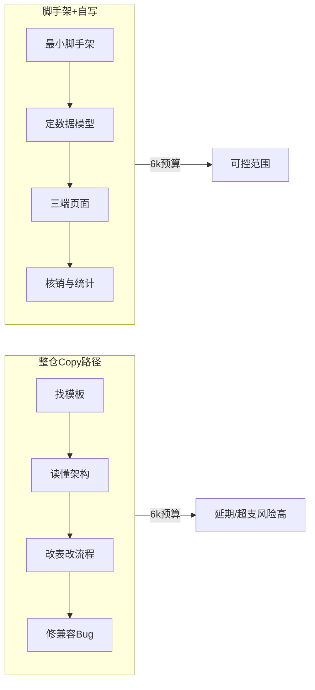

# 心理咨询小程序：抄项目 vs 从头写 — 决策建议

## 结论（先说答案）

**不建议整仓 copy 一个「预约类」开源/模板项目再改。**  
**建议：选官方/云开发最小脚手架 + 你自己（配合 AI）写业务逻辑。**

可接受的「抄」仅限于：**时段选择 UI、日历组件、表格后台布局** 等局部片段，而不是整套系统。

---

## 为什么整仓 copy 往往更亏（即使需求看起来简单）

你的核心不是「能预约」，而是 **次数包 + 有效期 + 两种咨询形态 + 核销扣次** 的组合，和市面上常见的模板差异很大：

| 能力 | 常见预约模板 | 本项目 |
|------|-------------|--------|
| 预约对象 | 单一服务/课程 | **1对1** 与 **1对多（工作坊）** 两套规则 |
| 扣次时机 | 下单/签到即扣 | 明确要 **教师核销后扣次**（还要防重复核销） |
| 用户权益 | 单次票 | **月卡/个咨**：N 个月内 x 次 1v1 + y 次 1vN |
| 角色 | 用户 + 商家 | **用户预约 + 教师核销 + 管理员代约/统计** |
| 代操作 | 少见 | 管理员可帮用户预约（权限与审计） |

整仓抄来的项目，**80% 的改造成本**会花在：删多余模块、改数据表、改状态机、改权限、修微信登录/云函数版本不匹配——往往比用 AI 按你的模型从头写 **更慢、更难报价**。

---

## 什么时候「抄」仍然值得

仅在以下条件 **同时满足** 时，才考虑 copy 整项目：

1. **许可证清晰**（MIT/Apache，可商用、可改、无闭源依赖）
2. **技术栈你愿意长期维护**（例如：原生小程序 + 微信云开发，或你熟悉的 uni-app + Node）
3. **业务模型已包含**：多角色、时段库存、预约状态机（待咨询/已完成/已取消）
4. **最近 1 年内仍有人维护**，且能在微信开发者工具里 **30 分钟内跑通**

现实中符合第 3 点的「心理咨询」模板极少；多数是 **健身房/医美/门诊挂号/教培排课**，抄过来仍要重写「次数包 + 核销」——**等于假抄。**

---

## 推荐实施路径（新项目、6k 口径）

### 技术选型（偏省工、好交付）

- **小程序端**：微信原生 或 uni-app（二选一即可；功能简单时原生 + 云开发往往最快）
- **后台**：轻量 Web 管理端（如 Next.js / Vue Admin 任一你熟练的）或 **云开发控制台 + 简单自定义页**
- **后端/数据**：微信云开发（云数据库 + 云函数）**或** 一台小服务器 + MySQL；6k 场景优先 **云开发**，减少运维与备案复杂度
- **登录**：微信一键登录 + 后台账号密码（管理员/教师绑定 openid 或手机号）

不必一开始就上复杂微服务。

### 必须先钉死的数据模型（抄不抄都要做）

这是项目真正的「复杂度」，建议 **自写且写清楚**，不要指望模板：

- `UserPackage`：用户、套餐类型（月卡/个咨）、有效期、剩余 `oneToOneRemaining`、`groupRemaining`
- `Teacher`：咨询师档案、可预约类型
- `TimeSlot`：教师 × 日期 × 时段 × 类型（1v1 名额=1；1vN 名额=N）
- `Appointment`：状态 `booked → completed（核销）| cancelled`；**仅在 completed 时扣 package**
- `Role`：`user | teacher | admin`

**关键规则（写进合同/原型）：**

- 预约成功：**不扣次**（或仅占用时段，按你与客户约定二选一，默认推荐不扣次）
- 教师核销：**扣次一次**；重复核销要拦截
- 取消预约：释放时段；若已核销则不允许用户自助取消（仅管理员处理）

### 6k 预算下的 MVP 范围（建议写进报价单）

**建议包含（第一版可交付）：**

- 用户：看剩余次数、选老师/时段、预约、我的预约列表
- 教师：我的预约列表、核销（扣次）
- 管理员：教师 CRUD、放时段、代用户预约、预约/用户简单统计导出或列表筛选

**建议二期或不包在 6k（避免亏损）：**

- 在线支付/续费（需求里提到续费，但支付涉及商户号、分账、退款策略，**单独报价**）
- 消息订阅/模板消息提醒（可后加）
- 多管理员权限细分、操作日志审计
- 复杂报表（图表、导出 Excel 美化）
- 咨询师自助排班（需求文档写「后期可能」——放二期）

用 **固定价 + 明确排除项** 保护 6k：客户要加支付/报表，就加钱或砍别的功能。

### 工期粗算（单人 + AI 辅助）

| 模块 | 估时 |
|------|------|
| 原型/表结构/规则确认 | 0.5–1 天 |
| 云开发/库表 + 核心 API | 1–1.5 天 |
| 小程序三角色页面 | 2–2.5 天 |
| 管理后台 | 1–1.5 天 |
| 联调 + 真机 + 小修 | 1 天 |
| **合计** | **约 6–8 人天**（6k 若按 800–1000/天需严格控制范围） |

AI 适合加速：**CRUD、表单、列表、云函数样板**；你必须亲自把关：**核销幂等、并发抢号、次数边界、取消规则**。

---

## 若坚持「抄」，最低风险抄法

不要搜「心理咨询小程序源码」整包下；改为：

1. 微信官方/云开发 **预约演示** 或 **QuickStart** 作壳
2. 从开源只抄 **组件级**：日历、时段格子、Table（注意 license）
3. **业务状态机、表结构、核销接口 100% 自写**

这样抄的是「轮子」，不是「整车」。

---

## 对客户（菲欧拉）沟通时的一句话定位

> 我们做的不是挂号系统，而是 **「付费次数包 + 咨询师档期 + 课后核销」** 的轻量运营工具；第一版先解决微信里手动撮合的效率问题，支付续费可以第二期再接。

---

## 最终建议清单

1. **决策**：**从头写（脚手架 + AI）> 整仓 copy**
2. **可复制**：UI 组件、时段选择交互；**不可复制**：次数包、核销、双咨询类型
3. **报价**：6k 绑死 MVP；续费/消息/高级报表单列为二期
4. **签约前必须书面确认**：扣次时机、取消规则、1vN 每场人数上限、代预约谁可操作
5. **交付物**：小程序 + 管理后台 + 简单部署说明；预留 1 周免费小 bug 修复窗（可选）

---

## 你需要在开工前问客户的 2 个问题（避免返工）

1. **1对多**：每场固定几人？超员是否允许排队还是硬上限？
2. **扣次**：是「核销扣次」还是「预约即扣次」？（强烈建议核销扣次，未到场可释放权益）

若客户坚持「预约即扣次」，逻辑更简单，但客诉风险更高，需在报价里说明。
